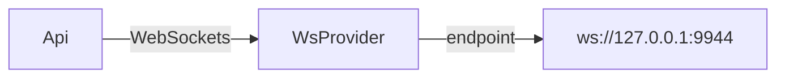

*__name__*: Rpc

*__summary__*: The API may use a HTTP or WebSockets provider.

*__description__*: It allows for querying a Polkadot Client Node. WebSockets provider is recommended since HTTP provider only supports basic querying.



*__example__*:   
```javascript
import Api from '@polkadot/rpc-core';
import WsProvider from '@polkadot/rpc-provider/ws';

const provider = new WsProvider('ws://127.0.0.1:9944');
const api = new Api(provider);
```

# Hierarchy

**Rpc**

# Implements

* `RpcInterface`

# Constructors

<a id="constructor"></a>

##  constructor

⊕ **new Rpc**(provider?: *`ProviderInterface`*): [Rpc](_index_.rpc.md)

*Defined in [index.ts:45](https://github.com/polkadot-js/api/blob/f31c35e/packages/rpc-core/src/index.ts#L45)*

*__constructor__*: Default constructor for the Api Object

**Parameters:**

| Param | Type | Default value | Description |
| ------ | ------ | ------ | ------ |
| `Default value` provider | `ProviderInterface` |  new WsProvider() |  An API provider using HTTP or WebSocket |

**Returns:** [Rpc](_index_.rpc.md)

___

# Properties

<a id="_provider"></a>

##  _provider

**● _provider**: *`ProviderInterface`*

*Defined in [index.ts:41](https://github.com/polkadot-js/api/blob/f31c35e/packages/rpc-core/src/index.ts#L41)*

___
<a id="author"></a>

##  author

**● author**: *`RpcInterface$Section`*

*Defined in [index.ts:42](https://github.com/polkadot-js/api/blob/f31c35e/packages/rpc-core/src/index.ts#L42)*

___
<a id="chain"></a>

##  chain

**● chain**: *`RpcInterface$Section`*

*Defined in [index.ts:43](https://github.com/polkadot-js/api/blob/f31c35e/packages/rpc-core/src/index.ts#L43)*

___
<a id="state"></a>

##  state

**● state**: *`RpcInterface$Section`*

*Defined in [index.ts:44](https://github.com/polkadot-js/api/blob/f31c35e/packages/rpc-core/src/index.ts#L44)*

___
<a id="system"></a>

##  system

**● system**: *`RpcInterface$Section`*

*Defined in [index.ts:45](https://github.com/polkadot-js/api/blob/f31c35e/packages/rpc-core/src/index.ts#L45)*

___

# Methods

<a id="signature"></a>

## `<Static>` signature

▸ **signature**(__namedParameters: *`object`*): `string`

*Defined in [index.ts:78](https://github.com/polkadot-js/api/blob/f31c35e/packages/rpc-core/src/index.ts#L78)*

*__name__*: signature

*__summary__*: Returns a string representation of the method with inputs and outputs.

*__description__*: Formats the name, inputs and outputs into a human-readable string. This contains the input parameter names input types and output type.

*__example__*:   
```javascript
import Api from '@polkadot/rpc-core';

Api.signature({ name: 'test_method', params: [ { name: 'dest', type: 'Address' } ], type: 'Address' }); // => test_method (dest: Address): Address
```

**Parameters:**

| Param | Type |
| ------ | ------ |
| __namedParameters | `object` |

**Returns:** `string`

___

